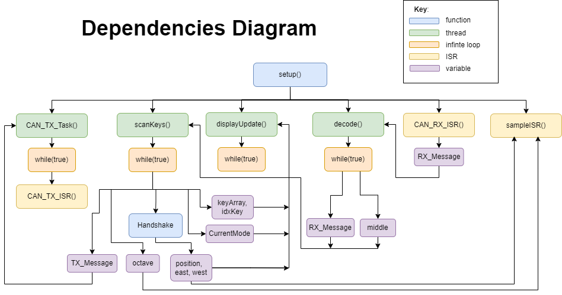
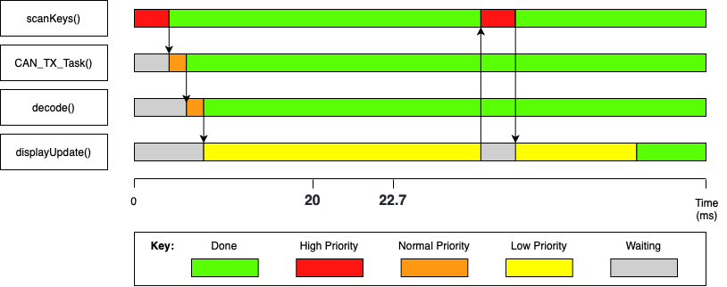

Authors:
- Sam Taylor, 01705109

- Martin Prusa, 01705109 

- Matilde Piccoli, 01764158

- Salman Dhaif, 01722410

# Introduction

The following report explains the implementations and design of our
Music Synthesizer. Our Synthesizer implements all core features outlined
in the specification, and the following advanced features:

-   Polyphony

-   Octave Control

-   Advanced Tone Waveform

-   Auto detection and Handshaking


# Task Algorithms and Dependencies

# Classes and Headers

For the purposes of modular design, the main source code uses four main
classes to implement functionality with some of the peripherals. The
classes implementation also facilitated collaboration between group
members and eases the development of robust, maintainable code. These
include:

-   **Knobs**: Allows interfacing with all knobs on the
    StackSynthesizer. It includes methods to initialize, read, decode
    and get the count of each of the knobs. As well, implementations of
    decay functions for Knob 0.

-   **Display**: Manages the user interface on the OLED display.
    Includes methods for initialization of the display and printing
    which are configurable to the mode of the module (Transmitter or
    Receiver).

-   **Wave**: Enables the generation of different waveforms. Includes a
    parent Wave class and child classes for each of the waveforms. As
    well, a method to set the output voltage for the speaker on the
    StackSynthesizer.

# Tasks and code structure

Continouing with the idea of a maintainable code we have implemented separate threads for each task. Our system consists of four threads and three interrupts (in order of
priority):

-   **sampleISR**: Interrupt responsible for updating Vout, the
    output voltage level dependent on the pressed key, volume, type of waveform
    and perfoming optional decay. 

-   **CANRXISR**: Interrupt responsible for the reception of data from
    the CAN bus. 

-   **CANTXISR**: Interrupt responsible for the transmission of data via
    the CAN bus.

-   **decode**: Thread managing the decoding of the information coming
    from the CAN bus (\...)

-   **CANTX**: Thread responsible for the collection of data to be
    transmitted via CAN (..generating corresponding interrupt\...)

-   **ScanKey**: Thread managing the decoding of inputs form the
    keyboard and knobs

-   **displayUpdate**: thread resbonsible for the generation of the LED
    display output
\

## Shared resources and Dependencies

Our system concurrently executes multiple threads to operate reliably.
Due to threads accessing global/shared variables and resources, as well
as the presence of ISR, it is necessary to ensure we analyse task
inter-dependencies to avoid deadlocking
(Fig.1)

||
|:--:|
| <b>Fig.1 - Dependancy FlowChart</b>|

When it comes to data shared between concurrent systems, there are
multiple risks, such as: the data is modified by multiple tasks at the same time
and the first change is overwritten; the data should be modify by a task
but is blocked by another task with lower priority.
The following analysis aims to assure that the data exchange in our code
is thread-safe, by using features such as Mutex and Semaphores, Queues,
atomic access and critical sections.
(Tab.1)

| **Shared Resource** | **Threads/ ISR and type of access**                   | **Strategy to avoid data corruption** |
|-----------------------|------------------------------------------------------------------|-----------------------------------|
| KeyArray              | ScanKey (write), displayUpdate (read)                            | Mutex, Semaphore                  |
| idxKey                | ScanKey (write), displayUpdate (read from local)                 | atomic acces                      |
| RXmessage             | CAN_RX_ISR (write), decode (read)                                | queue                             |
|                       | decode (write to local)                                          | Mutex, atomic access              |
|                       | displayUpdate (read)                                             | Mutex, Semaphore                  |
| TXmessage             | ScanKey (write), CAN_TX_ISR (read)                               | Queue                             |
| position              | scanKey (write), sample_ISR(read)                                | atomic access                     |
|                       | display (read frmo local)                                        | atomic access                     |
| west, est             | scanKey (write), displayUpdate (read from local)                 | atomic access                     |
| middle                | decode (write), scanKey (read)                                   | atomic access                     |
| octave                | sampleISR (read), scanKey (write to local),                      | atomic access                     |
| CurrentMode           | scanKey (write), display (read from local)                       | atomic access                     |
| count_knob            | scanKey (write), display (read from local)                       | atomic access                     |
|<b>Tab.1 - Shared resourses and protection</b>|

# Timing Analysis

## Performance Evaluation

Evaluation of our system performance was conducted through the measurement/calculation of all tasks and ISR execution time ,interval time and CPU utilization.We measure the execution time of our tasks and ISR by utilising the method set out in Lab 2. The calculation is an average across 32 iterations of that task.

```cpp 
uint32_t StartTotalTime = micros();
for(int i = 0 ; i < 32 ; i++){.... Task ....}
uint32_t TotalTime = micros()-StartTotalTime;
TotalTime = TotalTime/32;
Serial.println("Average Task Time:");
Serial.println(TotalTime);
```

Initiation time &tau;<sub>i</sub> is defined as the time between initiations of particular task. We get our CPU utilization U by the following: 

<center>
U = &sum;<sub>i</sub> &lceil;T<sub>i</sub> &#8260; &tau;<sub>i</sub> &rceil;
</center>

We get our CPU utilization U .Execution time , Initiation Interval. We calculate these for every ISR and Thread. Giving us the ability to establish correct priorities and timing.

| Task | Priority | Initiation Interval (&tau;<sub>i</sub>) [ms] | Execution Time (T<sub>i</sub>) [ms]| &lceil;<sup>&tau;<sub>n</sub></sup>&#8260;<sub>&tau;<sub>i</sub></sub>&rceil; T<sub>i</sub> [ms]| CPU Utilization [%]|
|-------------------|-----|-----------|---------|---------|--------|
sampleISR           | ISR | 0.04545   | 0.02    |  44     | 44     | 
CAN TX ISR          | ISR | 1.67      | 0.003   |  0.179  | 0.179  | 
scanKeys            | 4   | 20        | 0.410   | 2.05    | 2.05   |
decode              | 3   | 25.2      | 0.002   |  0.008  | 0.008  | 
CAN TX Task         | 2   | 60        | 0.001   | 0.0016  | 0.0016 | 
displayUpdate       | 1   | 100       | 22.732  | 22.732  | 22.732 | 
Total               |     |           |         | 68.9706 | 68.9706|

Given our total latency being the sum of &lceil;<sup>&tau;<sub>n</sub></sup>&#8260;<sub>&tau;<sub>i</sub></sub>&rceil; T<sub>i</sub> is less than &tau;<sub>n</sub> = 100. We can confirm that all tasks are executed with the longest task interval and we will not experience any deadline failures.


## Critical Instant Analysis
||
|:--:|
| <b>Fig.2 - Task and ISR Timeline</b>|
